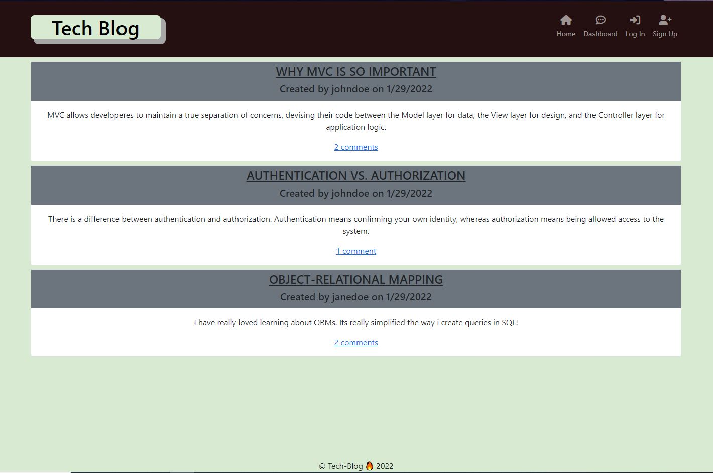

# Tech Blog 

## Description 

A simple tech-blog application using MVC layout

Repo: https://github.com/andrewyu22/tech-blog

Link: https://guarded-inlet-66016.herokuapp.com/

---
## Table of Contents 

* [Installation](#installation)
* [Usage](#usage)
* [License](#license)
* [Contributing](#contributing)
* [Tests](#tests)
* [Questions](#questions)

---
## Installation

1) "npm install" to install all required dependency
2) Set up ".env" file to connect to database

---
## Usage 

### HomePage

### Sign Up / Log In

### Dashboard
Click on Dashboard to see your post or Create a new Post. Note: Make sure you are logged in.

You can edit your post by clicking on "Edit post" below "Your Posts"

You can also add a comment by click on the title of the post.

---
## License

No Licenses for this project!

---
## Contributing

No contribution information for this project!

---
## Tests

1) Log in to Mysql from the Terminal in the root folder of the project and type: "source db/schema.sql" 
2) Quit out MySql Terminal. In the bash terminal type in: "npm run seeds"

---
## Questions

Link to Github: https://github.com/andrewyu22

If you have any further questions, please contact me at andrewyu2654@gmail.com
